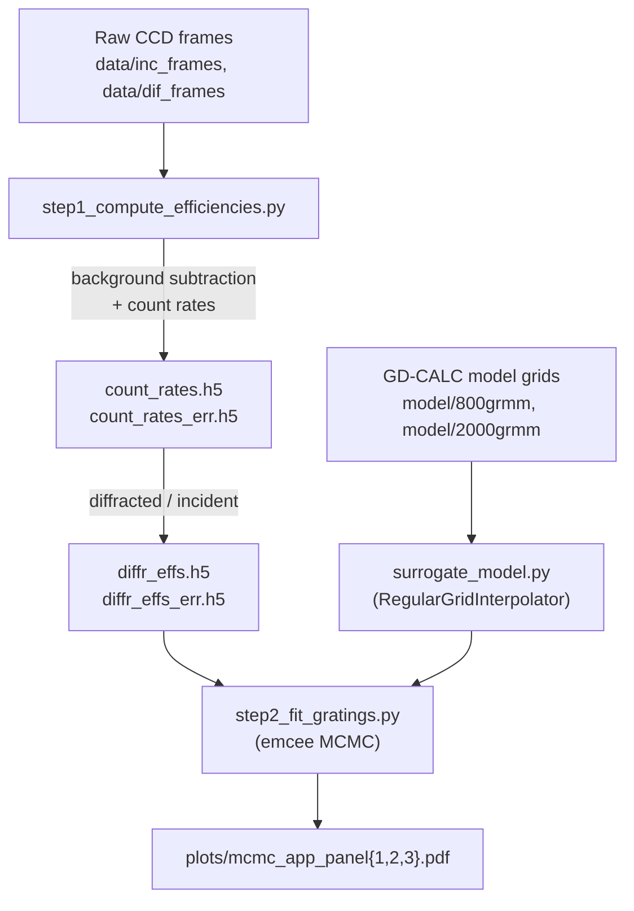

# Characterization of a symmetric-facet dual-ruled grating for spatial heterodyne spectroscopy

This repository contains the full analysis pipeline behind Meyer et al. 2026 characterizing a dual-ruled diffraction grating (800 gr/mm and 2000 gr/mm
panels) in the far-ultraviolet to visible. It takes raw CCD frames through to the
MCMC-fitted grating-profile parameters and the figures used in the paper.

The pipeline does two things:

1. **Measure** the diffraction efficiency of each grating panel and order from
   CCD photometry (background subtraction → count rates → efficiencies).
2. **Fit** a physical grating-profile model to those efficiencies with MCMC,
   using a fast interpolated surrogate of the [GD-CALC](#the-gd-calc-dependency)
   rigorous coupled-wave model.

---

## Table of contents

- [Repository structure](#repository-structure)
- [How the pipeline fits together](#how-the-pipeline-fits-together)
- [Requirements & installation](#requirements--installation)
- [Getting the data](#getting-the-data)
- [The GD-CALC dependency](#the-gd-calc-dependency)
- [Running the pipeline](#running-the-pipeline)
- [Outputs](#outputs)
- [Configuration](#configuration)
- [Reproducibility notes](#reproducibility-notes)
- [License](#license)
- [Citation](#citation)

---

## Repository structure

```
.
├── config.py                      # All paths and tunable constants (edit here)
├── background_subtraction.py      # Stray-light background subtraction (sub_bg)
├── surrogate_model.py             # Fast interpolated surrogate of the GD-CALC model
├── step1_compute_efficiencies.py  # STEP 1: frames -> count rates -> efficiencies
├── step2_fit_gratings.py          # STEP 2: MCMC fit + diagnostic figures
├── run_all.sh                     # Convenience: run step 1 then step 2
├── pyproject.toml                 # Project metadata + dependencies
├── uv.lock                        # Pinned dependency versions (reproducible env)
└── README.md
```

Data and model grids are **not** stored in this repository (they are large); see
[Getting the data](#getting-the-data). At run time the code expects:

```
.
├── data/
│   ├── inc_frames/                     # incident (reference) .sif frames
│   └── dif_frames/<panel>/<order>/     # diffracted .sif frames
│       # e.g. data/dif_frames/panel1/m=-1(CCW)/700nm_2119s.sif
│   # the four HDF5 products below are CREATED by step 1:
│   #   count_rates.h5   count_rates_err.h5
│   #   diffr_effs.h5    diffr_effs_err.h5
├── model/
│   ├── 800grmm/                        # GD-CALC efficiency grids, 800 gr/mm
│   └── 2000grmm/                       # GD-CALC efficiency grids, 2000 gr/mm
└── plots/                              # figures written by step 2 (auto-created)
```

Frame filenames follow the pattern `<wav>nm_<exp>s.sif`, where `<wav>` is a
three-digit wavelength in nm and `<exp>` is a four-digit exposure in seconds
(e.g. `700nm_2119s.sif` → 700 nm, 2119 s).

| Module | Role |
| --- | --- |
| `config.py` | Single source of truth for directory paths, the panel/order maps, the experimental systematic, the monochromator bandpass, and all MCMC settings. **Start here** to change anything. |
| `background_subtraction.py` | `sub_bg()` removes the smooth stray-light background from a single frame by masking the beam and fitting a 2-D polynomial to the remaining pixels. Used by step 1. |
| `surrogate_model.py` | `init_surrogate()` loads the precomputed GD-CALC grids and returns a fast interpolator over (groove density, order, dt, land, wavelength). Used by step 2. |
| `step1_compute_efficiencies.py` | Reads the raw `.sif` frames, computes per-frame count rates with uncertainties, then divides diffracted by incident to get diffraction efficiencies. Writes four HDF5 files. |
| `step2_fit_gratings.py` | Runs `emcee` per panel to fit the facet asymmetry `dt` and land duty cycle `land`, prints best-fit values and reduced χ², and saves the corner/trace diagnostic figures. |

---

## How the pipeline fits together



Step 1 and step 2 communicate **through the HDF5 files on disk**, exactly as in
the original two-stage workflow, so the numerical results are unchanged.

---

## Requirements & installation

- **Python ≥ 3.11**
- [**uv**](https://docs.astral.sh/uv/) for dependency management (recommended;
  the pinned `uv.lock` reproduces the exact environment used for the paper)

One dependency, [`funkyfresh`](https://github.com/zachariahmilby/funky-fresh)
(used for AAS-style plot formatting), is installed directly from GitHub; this is
already declared in `pyproject.toml`, so no manual step is needed.

With `uv` installed, no separate install step is required — `uv run` creates and
syncs the environment from `uv.lock` on first use. To pre-create it explicitly:

```bash
uv sync
```

(If you prefer plain `pip`, install the packages listed in `pyproject.toml`
into a Python ≥ 3.11 environment, including `funkyfresh` from its Git URL.)

---

## Getting the data

The raw frames and the GD-CALC model grids total roughly **320 MB** and are
archived on Zenodo:

> **Data DOI:** 10.5281/zenodo.20682543

Download and unpack the archive into the repository root so that the `data/` and
`model/` directories sit alongside the scripts (see
[Repository structure](#repository-structure)). The relative paths in
`config.py` assume this layout.

There are two ways to use the package, depending on how much you want to
recompute:

- **Reproduce the paper's figures (no MATLAB / GD-CALC needed).** The archive
  includes the precomputed GD-CALC efficiency grids under `model/`, so you can
  run the full pipeline — including the MCMC fit — using only Python.
- **Regenerate the model grids from scratch.** This requires GD-CALC and MATLAB;
  see below.

---

## The GD-CALC dependency

The forward model is the **Grating Diffraction Calculator (GD-CALC®)** by
Kenneth C. Johnson (KJ Innovation), a MATLAB implementation of rigorous
coupled-wave analysis. This repository does **not** redistribute GD-CALC. The
`model/` grids included with the data archive are GD-CALC *outputs*; the
surrogate in `surrogate_model.py` interpolates them.

If you want to regenerate the grids (different parameter sampling, a different
grating, etc.), obtain GD-CALC from its canonical source and run it in MATLAB to
produce CSVs named `tB<tB>_dt<dt>_land<land>.csv` (columns:
`wavelength_um, eff_-2, eff_-1, eff_0, eff_+1, eff_+2`) on the grid defined in
`surrogate_model.py`:

> GD-CALC (Grating Diffraction Calculator), Kenneth C. Johnson.
> Code Ocean capsule, DOI [`10.24433/CO.7479617`](https://doi.org/10.24433/CO.7479617).
> Please cite the specific version you use.

---

## Running the pipeline

From the repository root (so the relative paths resolve), run the two steps in
order:

```bash
# Step 1: raw frames -> count rates -> diffraction efficiencies (writes 4 HDF5 files)
uv run step1_compute_efficiencies.py

# Step 2: MCMC grating-profile fit + diagnostic figures
uv run step2_fit_gratings.py
```

Or run both at once:

```bash
bash run_all.sh
```

Step 1 takes a while (it loads and background-subtracts every frame). Step 2
runs three MCMC fits (one per panel) and prints best-fit parameters and a
per-order reduced χ² for each.

---

## Outputs

| File | Produced by | Contents |
| --- | --- | --- |
| `data/count_rates.h5` | step 1 | Per-wavelength count rate for `inc` and each `dif/<panel>/<order>` |
| `data/count_rates_err.h5` | step 1 | Relative count-rate uncertainties (same structure) |
| `data/diffr_effs.h5` | step 1 | Diffraction efficiency (fraction) per `<panel>/<order>` |
| `data/diffr_effs_err.h5` | step 1 | Efficiency uncertainties (fraction) |
| `plots/mcmc_app_panel1.pdf` | step 2 | Corner + trace diagnostics, panel 1 (800 gr/mm) |
| `plots/mcmc_app_panel2.pdf` | step 2 | Corner + trace diagnostics, panel 2 (2000 gr/mm) |
| `plots/mcmc_app_panel3.pdf` | step 2 | Corner + trace diagnostics, panel 3 (800 gr/mm) |

Efficiencies are stored as **fractions** in the HDF5 files; they are converted
to percent when loaded for fitting and plotting.

### Optional: the stacked best-fit ("keystone") figure

The stacked best-fit efficiency curves for all three panels can be regenerated
by setting `MAKE_KEYSTONE = True` near the top of `step2_fit_gratings.py`. It is
off by default (matching the archived run) and writes `plots/mcmc_keystone.pdf`.

---

## Configuration

Everything you might want to change lives in **`config.py`**:

- **Paths** — `DATA_DIR`, `MODEL_DIR`, `PLOTS_DIR` (default to `data`, `model`,
  `plots` relative to the working directory).
- **Experiment** — `PANEL_GR_DENS`, `ORDER_MAP`, `SIGMA_EXP` (the fixed
  experimental systematic added in quadrature), `BANDPASS` (monochromator
  half-bandpass).
- **MCMC** — `NWALKERS`, `NSTEPS`, `BURNIN`, `BOUNDS`, `PRIOR_MEANS`,
  `PRIOR_STDS`, `DT_SCATTER`, `LAND_SCATTER`, and `RNG_SEED`.

Per-frame background-subtraction tuning (the occasional custom `k_low` or
hand-drawn `beam_mask`) lives in `FRAME_CFG` inside
`step1_compute_efficiencies.py`; the keying rules are documented there.

---

## Reproducibility notes

- The MCMC is **stochastic**. With `RNG_SEED = None` (the default, matching the
  original run) the chains differ slightly from run to run, but the recovered
  posteriors are statistically equivalent because the chains are well converged.
  Set `config.RNG_SEED` to an integer for bit-for-bit reproducible chains.
- The environment is pinned in `uv.lock`; using `uv run` / `uv sync` reproduces
  the exact package versions used for the paper.
- Step 1 and step 2 are deterministic given the input frames and model grids.

---

## License

The code in this repository is released under an MIT license. Note that this license
covers **only the code here**; it does **not** cover GD-CALC, which is the
copyrighted work of Kenneth C. Johnson and is not redistributed (see
[The GD-CALC dependency](#the-gd-calc-dependency)).

---

## Citation

If you use this code, please cite the paper and the archived code/data record:

```bibtex
@inproceedings{MeyerEA26_characterization,
  author    = {{Meyer}, C and {Flores}, J and {Corliss}, J and {Harris}, W},
  title     = {Characterization of a symmetric-facet dual-ruled grating for spatial heterodyne spectroscopy},
  booktitle = {SPIE proceedings},
  year      = {2026},
  doi       = {<paper DOI>}
}

@misc{MeyerEA26_code,
  author    = {{Meyer}, C and {Flores}, J and {Corliss}, J and {Harris}, W},
  title     = {Code and data for "Characterization of a symmetric-facet dual-ruled grating for spatial heterodyne spectroscopy"},
  year      = 2026,
  publisher = Zenodo,
  doi       = 10.5281/zenodo.20682543
}
```

Please also cite GD-CALC (DOI [`10.24433/CO.7479617`](https://doi.org/10.24433/CO.7479617))
as the source of the diffraction-efficiency forward model.
